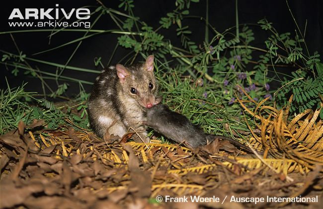

```{r setup, include=FALSE}
knitr::opts_chunk$set(echo = TRUE)
packages_needed <- c("ggplot2", # graphics
                     "plyr",
                     "arm", # display() etc.
                     "MASS",
                     "dplyr",
                     "ggfortify",
                     "easystats"
                     )
pk_to_install <- packages_needed [!( packages_needed %in% rownames(installed.packages())  )]
if(length(pk_to_install)>0 ){
  install.packages(pk_to_install,repos="http://cran.r-project.org")
}
#lapply(packages_needed, require, character.only = TRUE)
library(ggplot2)
library(plyr)
library(arm)
library(MASS)
library(dplyr)
library(ggfortify)
library(easystats)
```

## Going Down Under

The Northern quoll is a medium sized marsupial that lives in rocky landscapes an Eucalyptus forests in Northern Australia. They are known as the "Northern native cat" and directly compete for many of the same food resources as introduced invasive feral cats. These animals and their interactions with each other are being intensively studied given the destructive nature of feral cats on native Australian wildlife.

The goal of the data I used is to look at the abundance of Northern Quolls, feral cats and their prey and the relationship of these with a variety of den types.

[Dryad Dataset](https://datadryad.org/stash/dataset/doi:10.5061/dryad.0gb5mkkxt)

.jpg)

```{r quolls, include=FALSE}
quolls<-read.csv("predator_prey_abundance.csv")
```

## Looking at Invasive and Endemic Predator Interactions

.jpg)

This first set of analysis is focusing on the relationship between the number of quolls and the number of feral cats within all of their study sites. As you can see from this graph, the number of quolls in the area is smaller when there are more feral cats.

```{r Quoll and Competitor plot, echo=FALSE, message=FALSE, warning=FALSE}
ggplot(quolls, aes(northern.quoll, feral.cat)) + 
  geom_point(size=3, pch = 21) +
  geom_smooth(method="glm", method.args=list(family="poisson"(link="log"))) +
  ylab("Number of Feral Cats") +
  xlab("Number of Quolls in the Area")
```

## Running the Models

After getting a visualization for this relationship, I conducted the model analysis. There is an observed significant interaction between the number of quolls and the number of feral cats, but the data is severely over-dispersed. This study only has 28 study sites and only one predator count for each site, making it hard to get a normal distribution.

```{r poisson model}
model_cat_poisson <- glm(northern.quoll ~ feral.cat, family = poisson, data=quolls)
summary(model_cat_poisson)
```

```{r check the poisson model}
autoplot(model_cat_poisson)
```

Running a quasi-poisson model shows an about equal distribution of points, and the p-value is now insignificant, so it is not helpful in this case.

```{r quasi-Poisson model}
model_cat_quasi <- glm(northern.quoll ~ feral.cat, family = quasipoisson, data = quolls)
summary(model_cat_quasi)
```

```{r check the quasi-poisson model}
autoplot(model_cat_quasi)
```

## Looking at Native Predator/Prey Abundance

Quolls are carnivorous and insectivorous. Their diet consists of insects, small mammals, small lizards and occasionally small birds. Feral cats are direct competitors because of their similar diet. For this section, I focused on quolls and the abundance of prey items available to them.



```{r video, echo=FALSE, message=FALSE, warning=FALSE}
library(vembedr)
embed_youtube("aHMBP34Jroo")
```

```{r Quoll and Prey Plot, echo=FALSE, message=FALSE, warning=FALSE}
ggplot(quolls, aes(total, northern.quoll)) + 
  geom_point(size=3, pch = 21) +
  geom_smooth(method="glm", method.args=list(family="poisson"(link="log"))) +
  ylab("Number of Quolls") +
  xlab("Number of Prey items") +
  labs(caption = "Quolls and Prey Abundance")
```

Looking at this visualization, there is not a clear relationship between the number of prey items available and the presence of quolls at the different sites.

```{r diversity poisson model}
model_diversity_poisson <- glm(total ~ northern.quoll, family = poisson, data=quolls)
summary(model_diversity_poisson)
```

```{r check the diversity poisson model}
autoplot(model_diversity_poisson)
```

```{r diversity quasi-Poisson model}
model_diversity_quasi <- glm(total ~ northern.quoll, family = quasipoisson, data = quolls)
summary(model_diversity_quasi)
```

```{r check the diversity quasi-poisson model}
autoplot(model_diversity_quasi)
```

## Looking at Native Predator in Treatment Areas

This study looked at different treatment sites for Northern Quoll dens. There is an artificially created quoll den treatment, a natural unoccupied treatment and a natural occupied treatment. I chose to investigate prey availability and quoll detection in relation to the treatment area types.

.jpg)

.jpg)

```{r Specify the Treatment Poisson GLM}
Treatment.pois <- glm(total~northern.quoll*Treatment, family= poisson(link=log), data= quolls)
```

```{r summary pois1}
summary(Treatment.pois)
```

```{r box plot}
ggplot(quolls, aes(Treatment, total)) +
  geom_boxplot() +
  geom_jitter(shape=1, size=3, height = 0, width = .15)
```

I was going to do a model coefficient plot, but I was not happy where it was visually and for me it was just as difficult to read as the standard summary.

```{r}
qpois1 <- glm(total~northern.quoll*Treatment, quasipoisson, data= quolls)
summary(qpois1)
```

```{r coef of qposi1}
coef(qpois1)
```

```{r confit of qposi1}
confint(qpois1)
```
